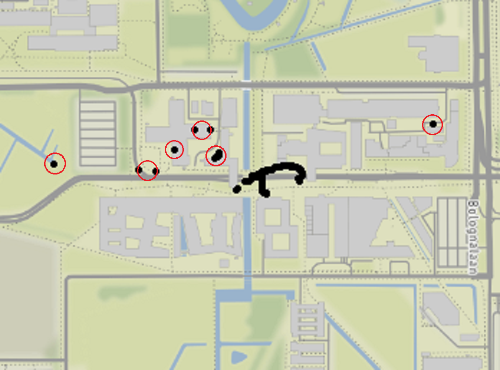

## WIN sensor data projects

- Travel/mobility
  - Stakeholders RWS/KiM
  - Location (GSM, Wi-Fi, GPS) and motion sensors
- Time use
  - Stakeholder SCP
  - Location (GSM, Wi-Fi, GPS) and motion sensors
  - Possibly wearables
- Budget expenditure
  - Eurostat project @ HBS
  - Location (GSM, Wi-Fi, GPS) and camera
- Fitness/physical activity
  - Stakeholders RIVM, GGD
  - Wearables
  
<aside class="notes">
  This project is a product of the Waarneming Innovatie Netwerk group that's a collaboration between University Utrecht and CBS. The WIN group is working with sensor data to find ways to expand and improve survey collection methodology across a number of different areas, including mobility, time use, budget and fitness.
</aside>

## WIN sensor data projects 

- **Travel/mobility**
  - **Stakeholders RWS/KiM**
  - **Location (GSM, Wi-Fi, GPS)**
- Time use
  - Stakeholder SCP
  - Location (GSM, Wi-Fi, GPS) and motion sensors
  - Possibly wearables
- Budget expenditure
  - Eurostat project @ HBS
  - Location (GSM, Wi-Fi, GPS) and camera
- Fitness/physical activity
  - Stakeholders RIVM, GGD
  - Wearables
  
<aside class="notes">
The goal is to provide for the Rijkswaterstaat and the Kennisinstituut voor Mobiliteit a field test for what it might look like to switch over from paper mobility surveys to an app-based approach that uses passive data from someone's cell phone to get a cheaper, more accurate and more detailed picture of what transportation looks like in the Netherlands.
</aside>
  
## CBS verplaatsingen app
- Fieldtest (Nov-Dec) oriented at evaluation of:
  + Effective recruitment and data collection strategies
  + Quality of sensor data and supplemental survey data
- Analyses
  + Fast to inform CBS and RWS management and decide on follow-up actions
  + Slow to search for effective editing and impotation methodologies and for sensible stop detection rules
- Analyses done by
  + Danielle McCool as PhD
  + Two EMOS students (Katie Roth and Laurent Smeets)
  + Traineeship (Lars Killaars)
  + WIN researchers

<aside class="notes">
We invited 1900 people to participate in the fieldtest of the app. The goal was to evaluate to what degree we'd be able to successfully get people to participate at all, and to see what the quality of the data was going to look like. Conveniently for that, we sampled from participants who had recently completed a paper-based survey on mobility from the Rijkswaterstaat, so we've got their self-reported data to compare against. 

We have a strong team working on two sets of analyses. 
Goal of first: fast reports to inform future decisions
Goal of second: Effective editing and imputation methodologies and stop detection
</aside>

## {data-background-video="tour_video_transportmode_nl.mp4" data-background-video-loop="loop"}


## {data-background-video="tour_video_stop_motive_nl.mp4" data-background-video-loop="loop"}


## Dimensions of the data


<aside class="notes">
We collect a lot of different types of data from the user in order to support this system. 
</aside>

## Important bits

- Device information
- Location data
- Track data
- Stop data
- Daily Questions

<aside class="notes">
Here's the most important bits. 
</aside>

## Device information

- Make
- Model
- OS
- OS version

## Location data

- High-tracking mode: 1 measurement per second
- Low-trackign mode: 1 measurement per minute

<aside class="notes">
I'll talk later about how the device decides to go into high and low tracking mode
Almost-continuous passive data. 
As long as the app is running in the background, we're receiving location updates.
</aside>

## Track data

- Start time
- Stop time
- *Transportation mode*

## Stop data

- Start time
- Stop time
- *Stop name*
- *Stop motive*

## Daily questions

- "Did you have your phone with you today?"
- "Was today a normal day for you?"


## Interesting challenges

> - **Incomplete data**
> - Device differences
> - Strange sensor measurements
> - Sensitivity vs. battery life
> - **What is a stop**


## What is a stop?


## What is a stop (lvl 2)


## What is a stop (lvl 3)


## Not a stop

- Waiting at a stoplight
- Being stuck in traffic
- Switching Wi-Fi on and having your position change
 
## A stop

- Going from one building to another on campus
- Taking your dog to the dog park
- Dropping your kid off at school

## ???

- Waiting for your train at the station
- Taking your dog for a walk
- Going to ask the neighbors for your package


## Our stop definition

Two levels

1. Data collection
2. User interface

## Data collection

Parameters trigger 'high-tracking' and 'low-tracking' modes on the device.

1. Distance Delta Limit 
2. Time period within that radius

```{R echo = TRUE, eval=FALSE}
bool Check(TimeSpan period)
{
 isMoving     = (Position_B - Position_A > Distance Delta Limit);
 isWithinTime = (Position_B_Time - Position_A_Time < Time Period Allowed);
  
  return !isMoving && !isWithinTime;
}
```

<aside class="notes">
We have to identify when a person has been within a given radius for a sufficient time that we can identify them as stopped. Our method occurs within the app itself and requires two(ish) parameters. 
</aside>
 

## User interface

1. **Grouping radius**
2. **Time**
3. Minimum Stop Accuracy
4. Stop merge radius
5. Stop merge max travel radius

<aside class="notes">
- Different because we want to collect data more precisely
- THe fieldtest has two experimental parameters
</aside>

## Grouping radius parameter



## Time parameter


## Better interpretation


## Missing data

Missing data occurs at myriad levels within this data.

> 1. Recruitment
> 2. App/device incompatibility
> 3. App installation
> 4. App closes itself
> 5. App only has location on Wi-Fi or GPS
> 7. Device dies
> 8. Short losses due to tunnels or buildings

## Missing data in the recruitment phase


## Missing data over time per OS


## Missing data within a day


## Missing data within a trip


## {data-background-image="routegif2.gif"}

## Next steps

PhD project consists of five projects (2018-2021):

- A descriptive paper over the app
- Adjustment for missing data in CBS verplaatsingen app
- Adjustment for measurement error/inaccurate measurements in CBS verplaatsingen app
- Two projects linked to time-use sensor data


## Summary

- Field test with 1900 to make a first foray into replacing paper surveys
- App generally successful
- Self-reported stops are difficult to reproduce programmatically
- Lots of flavors of missingness
- Immediate issues: reporting distance to the stakeholders

<small>Like to know more?</small>
<small>* d.m.mccool@uu.nl or bstn@cbs.nl</small>


