## Sensor data projects from WIN {data-transition="none"}

-  Travel/mobility
- Time use
- Budget expenditure
- Fitness/physical activity

## This projet {color="#cccccc"}

We record always-on passive location data 

from mobile devices

for the Ministry of Infrastructure

  to supplement existing travel diary studies  

 to replace existing travel diary studies 

  
## CBS travel app

CBS in-house programmer (intern)

Field test **11/2018** -- **12/2018** 

1902 letters

## CBS field test data

Data being digested by: 

- 2 Research Masters students
- 3ish interns
- Handful of programmers
- At least two professors
- 1 PhD student

## Stops
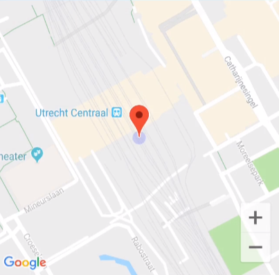

 User-supplied motive 

 User-supplied name 

***
<video class="stretch" src="tour_video_stop_motive_nl.mp4"></video>

## Tracks

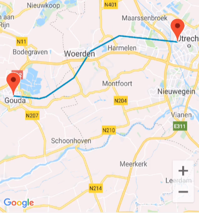

 Only get a transport mode 

&#128692; &#128663;  &#128641; 

***
<video class="stretch" src="tour_video_transportmode_nl.mp4"></video>

## Important bits

 Device information 

Location data 

Track data 

Stop data

Daily Questions

<aside class="notes">
Here's the most important bits. 
</aside>

## Important bits

- Location data 
- Track data 
- Stop data

## Location data

- High-tracking mode: 1 measurement per second
- Low-tracking mode: 1 measurement per minute

## Track data

- Start time
- Stop time
- *Transportation mode*

## Stop data

- Start time
- Stop time
- *Stop name*
- *Stop motive*

## Interesting challenges

**Incomplete data** 

Device differences 

Strange sensor measurements 

Sensitivity vs. battery life 

**What is a stop** 

## What is a stop?

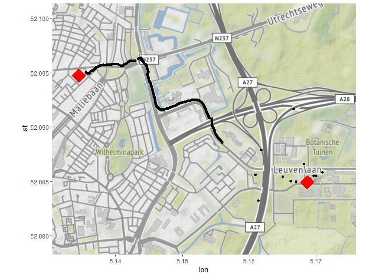

## What is a stop (lvl 2)

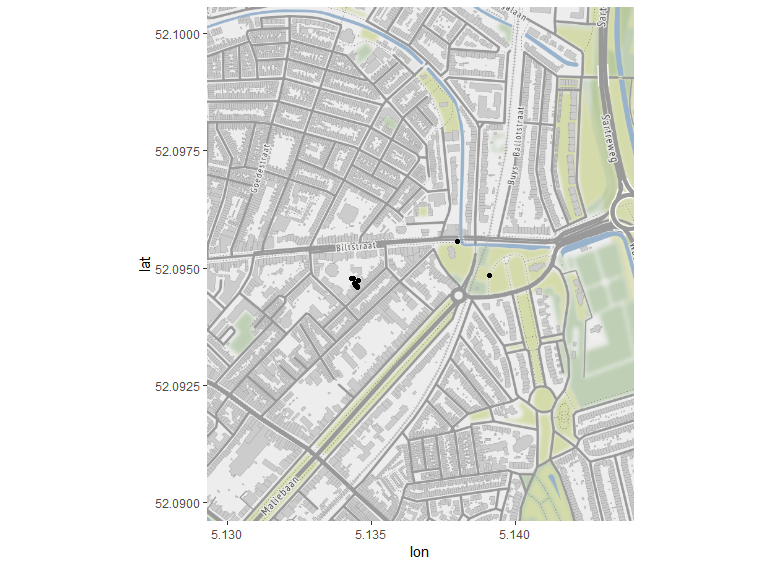

## What is a stop (lvl 3)

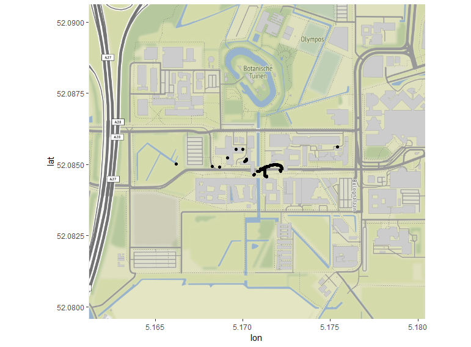

## Not a stop

- Waiting at a stoplight
- Being stuck in traffic
- Switching Wi-Fi on and having your position change
 
## A stop

- Going from one building to another on campus
- Taking your dog to the dog park
- Dropping your kid off at school

## ???

- Waiting for your train at the station
- Taking your dog for a walk
- Going to ask the neighbors for your package

## Our stop definition

Two levels

1. Data collection
2. User interface

## Data collection

Parameters trigger 'high-tracking' and 'low-tracking' modes on the device.

1. Distance Delta Limit 
2. Time period within that radius

## User interface

1. **Grouping radius**
2. **Time**
3. Minimum Stop Accuracy
4. Stop merge radius
5. Stop merge max travel radius

<aside class="notes">
- Different because we want to collect data more precisely
- THe fieldtest has two experimental parameters
</aside>

## Grouping radius parameter

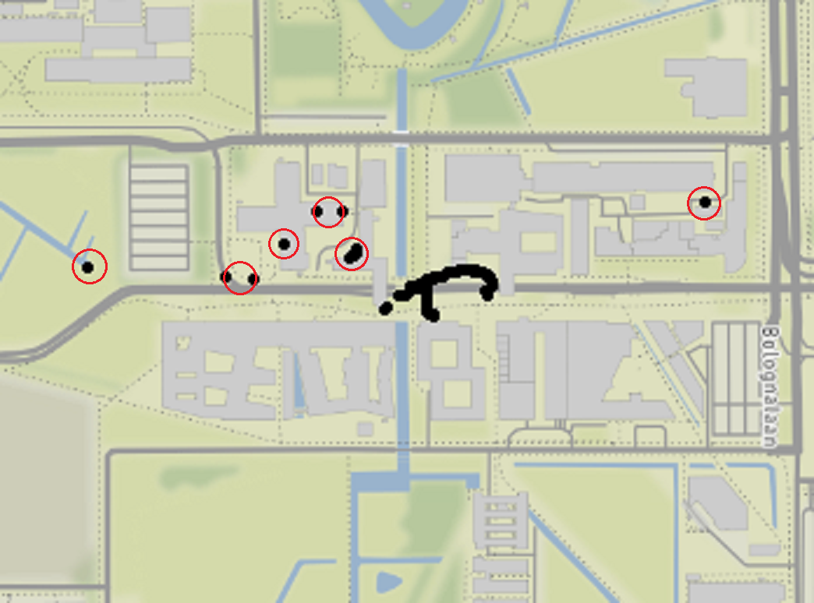

## Time parameter

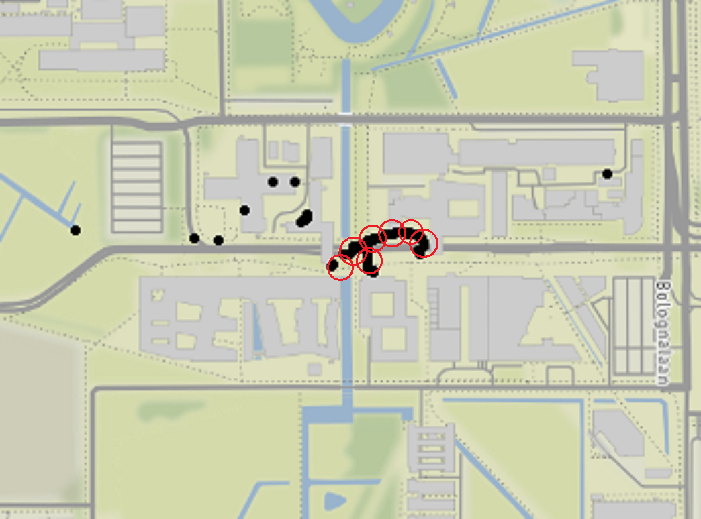

## Better interpretation

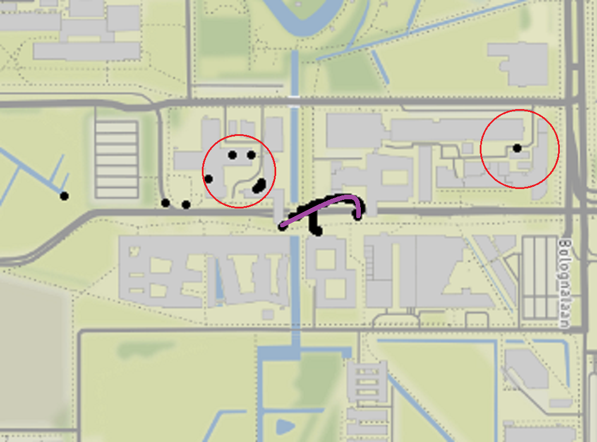

## Missing data

Missing data occurs at myriad levels within this data.

> 1. Recruitment
> 2. App/device incompatibility
> 3. App installation
> 4. App closes itself
> 5. App only has location on Wi-Fi or GPS
> 7. Device dies
> 8. Short losses due to tunnels or buildings

## Missing data in the recruitment phase

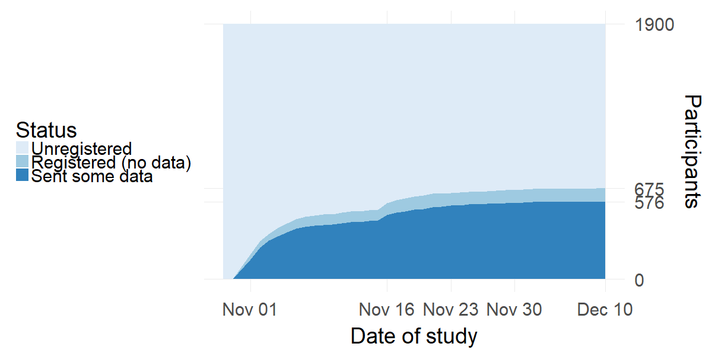

## Missing data over time per OS

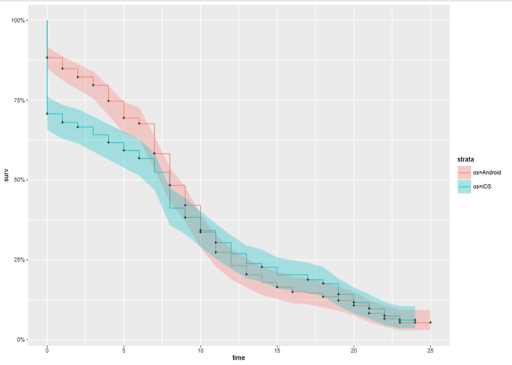

## Missing data within a day

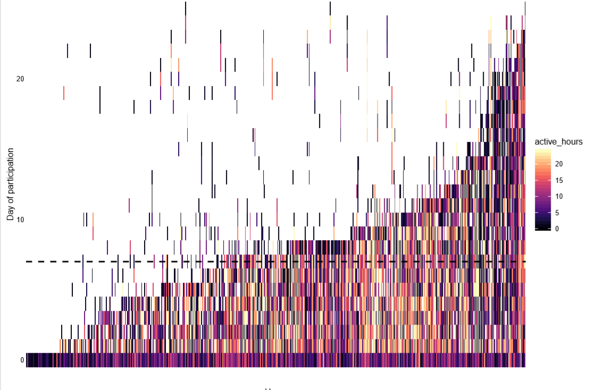

## Missing data within a trip

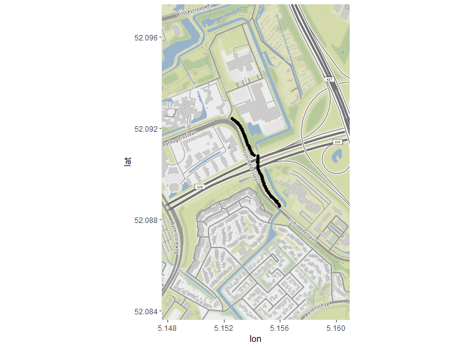

## {data-background-image="routegif.gif"}

## Next steps

PhD project consists of five projects (2018-2021):

- A descriptive paper over the app
- Adjustment for missing data in CBS verplaatsingen app
- Adjustment for measurement error/inaccurate measurements in CBS verplaatsingen app
- Two projects linked to time-use sensor data

## Summary

- Goal: critically examine app as diary replacement
- Field test had over 600 respondents
- Self-reported stops are difficult to reproduce programmatically
- Lots of flavors of missingness
- Immediate issues: reporting distance to the stakeholders

<small>Like to know more?</small>
<small>d.m.mccool@uu.nl</small>

